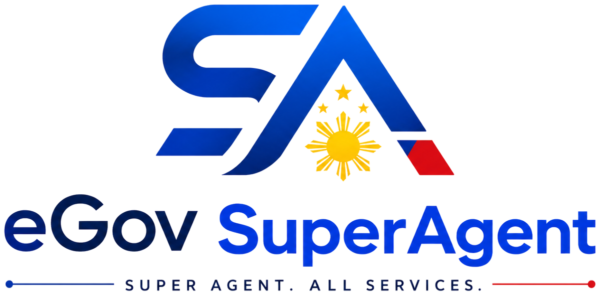

<div align="center">



### Super Agent. All Services.

**The Autonomous eGov OS for 115M Filipinos. Utusan mo lang.**

</div>

---

An MVP of an autonomous agent that handles Philippine e-government errands end to
end: it checks your SSS contributions, reads your PhilHealth membership, tracks a
PSA request to the pickup counter, keeps your IDs in a vault encrypted on your own
device, and hands you a receipt for every step so no fixer is ever needed.

## Routes

| Route | What it is |
| --- | --- |
| `/` | Landing — light by default with a dark/light toggle: animated hero, Why SuperAgent, services bento, Anti-Fixer Receipt |
| `/onboarding` | First-run intro — three swipeable slides, shown once per browser |
| `/app` | The console — same theme as the landing: sidebar, chat with generative UI, vault + receipt + memory rail |
| `/api/webhook/messenger` | `POST` logs the payload and returns `{ ok: true }`; `GET` completes the `hub.challenge` handshake when `MESSENGER_VERIFY_TOKEN` matches |

## Run it

```bash
npm install
npm run dev      # http://localhost:3000
```

```bash
npm run build && npm start   # production build
npm run typecheck            # tsc --noEmit
npm run lint                 # next lint
```

No database, no auth, no API keys — `npm install && npm run dev` is the whole
setup.

## Stack

Next.js 14 (App Router) · TypeScript · Tailwind CSS · Framer Motion · Lucide.
Documents are encrypted with the Web Crypto API and stored in IndexedDB; PDFs are
generated client-side with jsPDF; the PSA pickup code uses `qrcode.react`.
Deliberately nothing else.

## Layout of the code

```
mocks/                        sss.json, philhealth.json, psa.json — the only data source
public/logo.png               primary lockup (transparent) — hero, footer, README
public/logo-icon.png          SA monogram only — nav, compact chrome
public/logos/                 favicons + earlier kit exports (source/ holds the originals)
src/app/
  ├─ page.tsx                 landing
  ├─ app/page.tsx             console
  ├─ api/webhook/messenger/   Messenger webhook
  ├─ layout.tsx               metadata, favicons, OG
  └─ robots.ts, sitemap.ts    generated from NEXT_PUBLIC_SITE_URL
src/components/
  ├─ onboarding/            three-slide intro, its illustrations, and the /app gate
  ├─ landing/                 nav, hero, why, services bento, trust receipt, footer, background FX
  ├─ theme/                   ThemeProvider + pill toggle (localStorage 'egov-theme')
  ├─ generative-ui/           SSSContributionsCard, PhilHealthCard, PSATrackerCard, card chrome, sketch map
  ├─ vault/                   VaultPreview — encrypt / list / decrypt / delete
  ├─ receipts/                AntiFixerReceipt
  └─ egov/                    app shell, sidebar, chat panel, composer, memory graph
src/lib/                      brand tokens, typed mock access, agent intents, vault crypto, PDF export
src/lib/user.ts               guest-by-default identity store (localStorage 'egov-user')
src/lib/onboarding.ts         first-run flag (localStorage 'egov-onboarded')
src/middleware.ts             public-path allowlist + baseline security headers
```

## How the chat works

`src/lib/agent.ts` does Taglish-tolerant keyword routing — no model is involved.
Input matching `sss` renders `<SSSContributionsCard>`, `philhealth` renders
`<PhilHealthCard>`, and `psa`/`birth` renders `<PSATrackerCard>`, each with a
Taglish reply and follow-up chips. Unmatched input gets an honest "hindi ko pa
kaya 'yan" listing the four connected agencies.

Landing service tiles deep-link a first utos into the console:
`/app?q=check%20my%20sss%20contributions`.

## Theming

The landing is **light by default** — the brand lockup was drawn for a light
surface — with a pill toggle in the header. The choice persists in
`localStorage` under `egov-theme` and is applied by a pre-paint inline script, so
a returning dark-mode visitor never sees a white flash.

The console at `/app` follows the same toggle, so walking from the landing into
the app never changes the furniture. Both surfaces read the same `lp-*` Tailwind
palette and CSS variables; `eg-*` classes carry only the console's structural
bits (solid panels, scrollbars, receipt glow) and inherit those same variables.

One deliberate exception: the generative-UI cards stay white in both themes.
Anything on a white document surface is an agency record you can download or
show at a counter — that meaning would be lost if it followed the theme.

## First run

A visitor who has not seen the console is sent to `/onboarding` — three slides
covering how to ask, how the vault keeps the key on their device, and why the
receipt makes a fixer pointless. Swipe, arrow keys, the dots or the button all
page through; Skip and "Login here" jump straight in.

Finishing sets `egov-onboarded` in localStorage and every later visit opens
`/app` directly. A deep link survives the detour: `/app?q=…` becomes
`/onboarding?next=…` and the prompt still runs once the console opens.

## Identity

There is no account system, so identity lives in the browser and starts empty:
a fresh visitor is **Guest User — Connect PhilSys ID**. Nothing is claimed about
them, the memory graph is empty, and agency cards are labelled "Demo record"
rather than printing the sample citizen's name at somebody else's demo.

"Connect ID" asks for a name and optionally an ID document, which goes straight
into the encrypted vault. From then on the sidebar, the chat header, the memory
graph, the receipt audit trail, the agency cards and the generated PDFs all use
that name. Disconnecting returns everything to guest.

The name is typed, not read off the ID — there is no OCR in this build, and a
wrong guess from an image would be worse than asking.

## Vault

`src/lib/vault.ts` is real client-side encryption, not a stub:

- AES-GCM 256 via Web Crypto, fresh 12-byte IV per document.
- The master key is a **non-extractable** `CryptoKey` structured-cloned into
  IndexedDB — usable for decrypt, impossible to export.
- Ciphertext and IV live in IndexedDB; nothing is uploaded.
- Where IndexedDB is unavailable it falls back to localStorage, which requires an
  extractable key. That is weaker, so the UI says so instead of pretending
  otherwise.

Three demo documents are seeded on first load; "Add Doc" encrypts real files, and
clicking a row decrypts it back into a download.

## Deploying to Vercel

1. Import the repository at [vercel.com/new](https://vercel.com/new). Framework
   preset **Next.js** is detected; no build overrides are needed.
2. Environment variables — both optional:

   | Name | When you need it |
   | --- | --- |
   | `NEXT_PUBLIC_SITE_URL` | Preview deployments, so canonical/OG/sitemap URLs point at the preview instead of the live domain. Production can leave it unset. |
   | `MESSENGER_VERIFY_TOKEN` | Only to complete the Messenger webhook handshake. |

3. Deploy. `vercel.json` pins functions to `sin1` (Singapore), the closest region
   to the Philippines.

### Domain: egovsuperagent.online

In **Project → Settings → Domains**, add `egovsuperagent.online` and
`www.egovsuperagent.online`, then set these records at your
domain registrar's DNS and let Vercel issue the certificate:

| Type | Name | Value |
| --- | --- | --- |
| `A` | `@` | `76.76.21.21` |
| `CNAME` | `www` | `cname.vercel-dns.com` |

Vercel shows the exact target values on the Domains screen — use those if they
differ from the defaults above. Pick one host as primary (apex is the
conventional choice here) and let Vercel redirect the other. Once the domain
resolves, `robots.txt`, `sitemap.xml` and every OG URL follow it automatically
through `SITE_URL`.

## Licensing

Built by **AXLA SOFTWARE DEVELOPMENT SERVICES**. The attribution appears in the
landing footer, the console sidebar, the Anti-Fixer Receipt, and as
`<meta name="author">`.

## Scope

Everything on screen is mock data from `/mocks`. There is no SSS, PhilHealth,
Pag-IBIG or PSA integration, no Viber channel, and no blockchain. Messenger is
plumbed but not handled. This is a demonstration build and is not affiliated
with any Philippine government agency.
