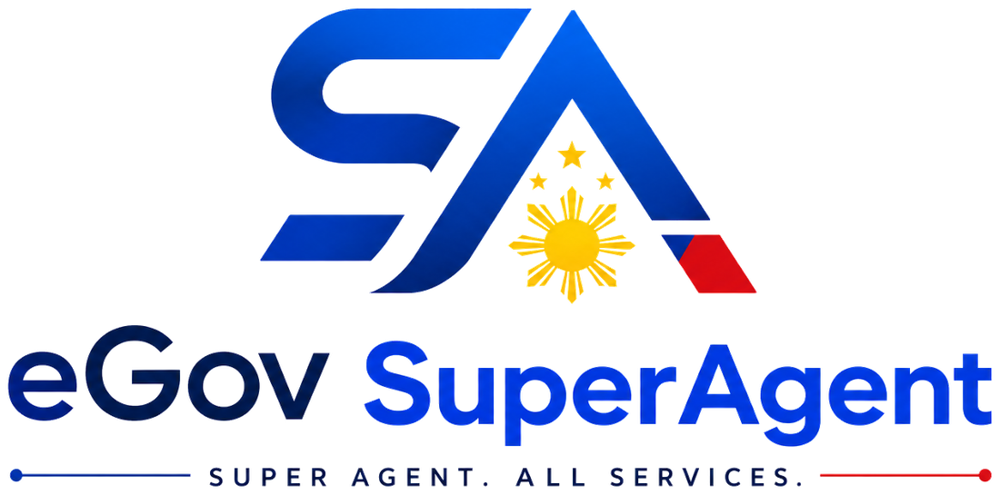

<div align="center">



### Super Agent. All Services.

**The Autonomous eGov OS for 115M Filipinos. Utusan mo lang.**

</div>

---

An MVP of an autonomous agent that handles Philippine e-government errands end to
end: it checks your SSS contributions, reads your PhilHealth membership, tracks a
PSA request to the pickup counter, keeps your IDs in a vault encrypted on your own
device, and hands you a receipt for every step so no fixer is ever needed.

## Routes

| Route | What it is |
| --- | --- |
| `/` | Landing — hero, Agent vs SuperAgent comparison, SSS/PhilHealth/PSA previews, trust pillars |
| `/app` | The console — sidebar, chat with generative UI, vault + receipt + memory rail |
| `/api/webhook/messenger` | `POST` logs the payload and returns `{ ok: true }`; `GET` completes the `hub.challenge` handshake when `MESSENGER_VERIFY_TOKEN` matches |

## Run it

```bash
npm install
npm run dev      # http://localhost:3000
```

```bash
npm run build && npm start   # production build
npm run typecheck            # tsc --noEmit
npm run lint                 # next lint
```

No database, no auth, no API keys — `npm install && npm run dev` is the whole
setup.

## Stack

Next.js 14 (App Router) · TypeScript · Tailwind CSS · Framer Motion · Lucide.
Documents are encrypted with the Web Crypto API and stored in IndexedDB; PDFs are
generated client-side with jsPDF; the PSA pickup code uses `qrcode.react`.
Deliberately nothing else.

## Layout of the code

```
mocks/                        sss.json, philhealth.json, psa.json — the only data source
public/logos/                 brand assets (processed) + source/ (original kit exports)
src/app/
  ├─ page.tsx                 landing
  ├─ app/page.tsx             console
  ├─ api/webhook/messenger/   Messenger webhook
  ├─ layout.tsx               metadata, favicons, OG
  └─ robots.ts, sitemap.ts    generated from NEXT_PUBLIC_SITE_URL
src/components/
  ├─ generative-ui/           SSSContributionsCard, PhilHealthCard, PSATrackerCard, card chrome, sketch map
  ├─ vault/                   VaultPreview — encrypt / list / decrypt / delete
  ├─ receipts/                AntiFixerReceipt
  └─ egov/                    app shell, sidebar, chat panel, composer, memory graph, landing sections
src/lib/                      brand tokens, typed mock access, agent intents, vault crypto, PDF export
src/middleware.ts             public-path allowlist + baseline security headers
```

## How the chat works

`src/lib/agent.ts` does Taglish-tolerant keyword routing — no model is involved.
Input matching `sss` renders `<SSSContributionsCard>`, `philhealth` renders
`<PhilHealthCard>`, and `psa`/`birth` renders `<PSATrackerCard>`, each with a
Taglish reply and follow-up chips. Unmatched input gets an honest "hindi ko pa
kaya 'yan" listing the four connected agencies.

Landing preview cards deep-link a first utos into the console:
`/app?q=check%20my%20sss%20contributions`.

## Vault

`src/lib/vault.ts` is real client-side encryption, not a stub:

- AES-GCM 256 via Web Crypto, fresh 12-byte IV per document.
- The master key is a **non-extractable** `CryptoKey` structured-cloned into
  IndexedDB — usable for decrypt, impossible to export.
- Ciphertext and IV live in IndexedDB; nothing is uploaded.
- Where IndexedDB is unavailable it falls back to localStorage, which requires an
  extractable key. That is weaker, so the UI says so instead of pretending
  otherwise.

Three demo documents are seeded on first load; "Add Doc" encrypts real files, and
clicking a row decrypts it back into a download.

## Deploying to Vercel

1. Import the repository at [vercel.com/new](https://vercel.com/new). Framework
   preset **Next.js** is detected; no build overrides are needed.
2. Environment variables — both optional:

   | Name | When you need it |
   | --- | --- |
   | `NEXT_PUBLIC_SITE_URL` | Preview deployments, so canonical/OG/sitemap URLs point at the preview instead of the live domain. Production can leave it unset. |
   | `MESSENGER_VERIFY_TOKEN` | Only to complete the Messenger webhook handshake. |

3. Deploy. `vercel.json` pins functions to `sin1` (Singapore), the closest region
   to the Philippines.

### Domain: egovsuperagent.ph

In **Project → Settings → Domains**, add `egovsuperagent.ph` and
`www.egovsuperagent.ph`, then set these records at your `.ph` registrar
(dot.ph / DNS host) and let Vercel issue the certificate:

| Type | Name | Value |
| --- | --- | --- |
| `A` | `@` | `76.76.21.21` |
| `CNAME` | `www` | `cname.vercel-dns.com` |

Vercel shows the exact target values on the Domains screen — use those if they
differ from the defaults above. Pick one host as primary (apex is the
conventional choice here) and let Vercel redirect the other. Once the domain
resolves, `robots.txt`, `sitemap.xml` and every OG URL follow it automatically
through `SITE_URL`.

## Scope

Everything on screen is mock data from `/mocks`. There is no SSS, PhilHealth,
Pag-IBIG or PSA integration, no Viber channel, and no blockchain. Messenger is
plumbed but not handled. This is a demonstration build and is not affiliated
with any Philippine government agency.
